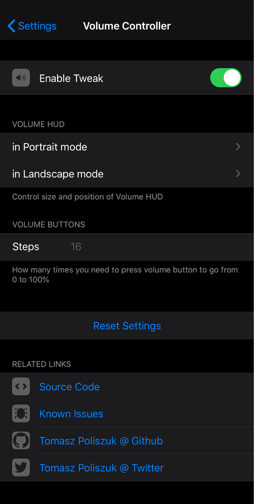
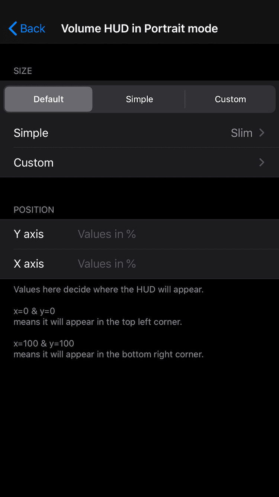
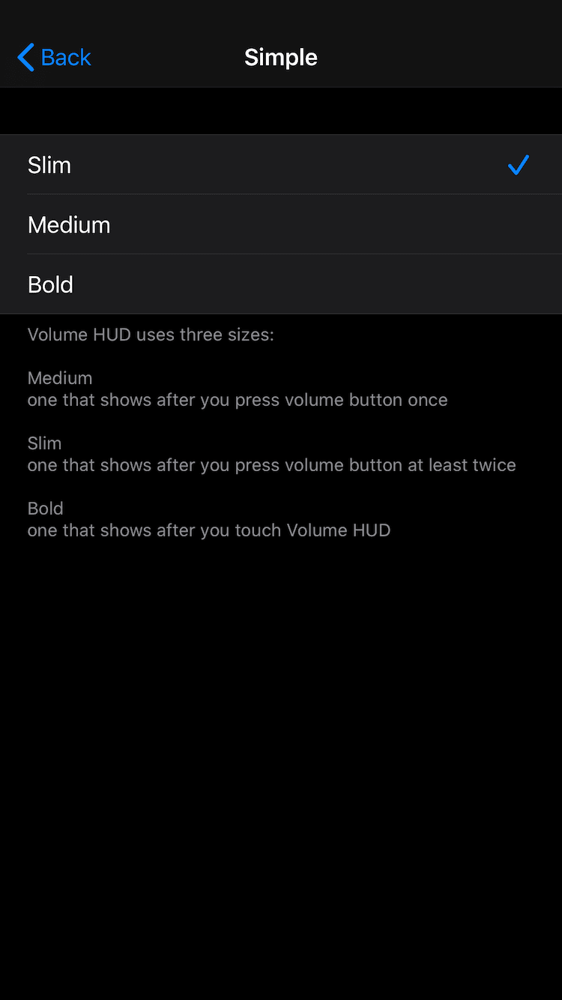
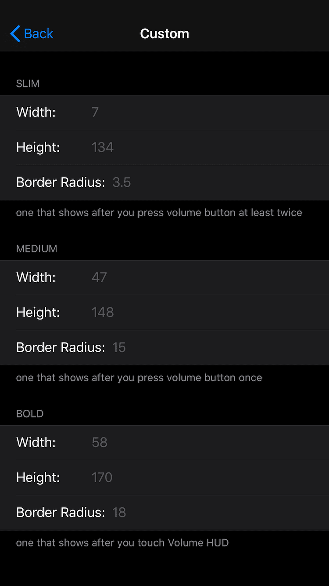
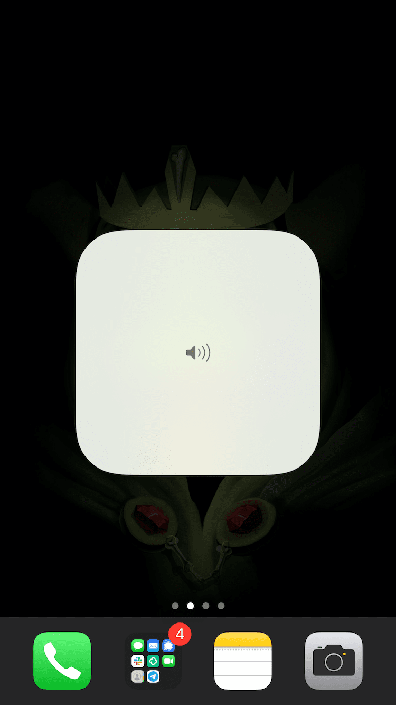
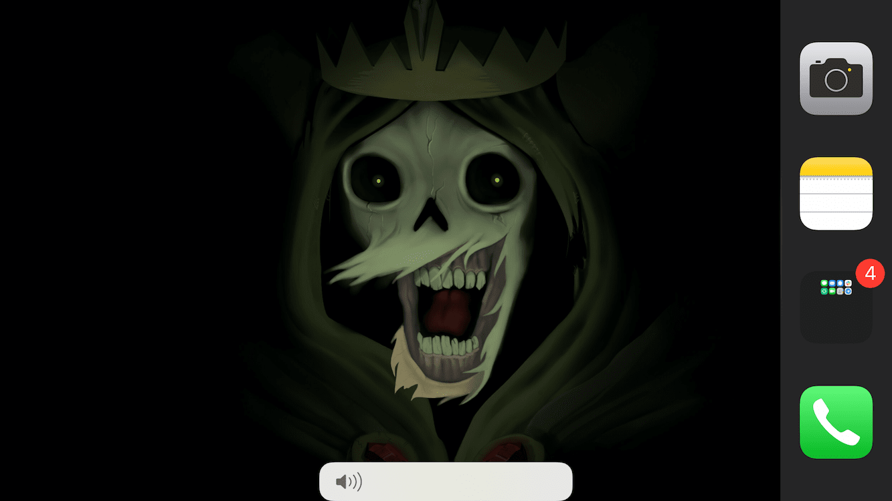

# Volume Controller - Control your Volume

## Compatibility
For iOS 13 and above

## What you can do with this tweak:
- **Look of Volume HUD**
	* Disable or select between vertical and horizontal Volume HUD in landscape and portrait positions of device
	* Change size and position of the Volume HUD in both portrait and landscape mode.
	* Choose between the iOS default look and a slim and bold version of it and move the HUD freely on the screen.
- **Volume steps**
	* Default iOS behavior is 16 steps, which means that every time you press one of the volume buttons the volume changes about 6.25%.
	* Volume Controller allows you to change the number of steps it takes to change the volume from 0% to 100%, e.g. a value of 50 means you have to press the volume up button 50 times to go from 0% to maximum volume.

Configure options from Settings, no respring needed.

Shoutout goes to u/bndrnt from reddit for helping with polishing the tweak settings and the German translation.
Spanish translation provided by [Retosteante](https://twitter.com/Retosteante) from twitter.

If you wish to add localization in your language please use [this file](https://github.com/tomaszpoliszuk/VolumeController/blob/master/VolumeControllerSettings/Resources/en.lproj/Root.strings) - if you have any issues feel free to contact me directly.

## Screenshots:

